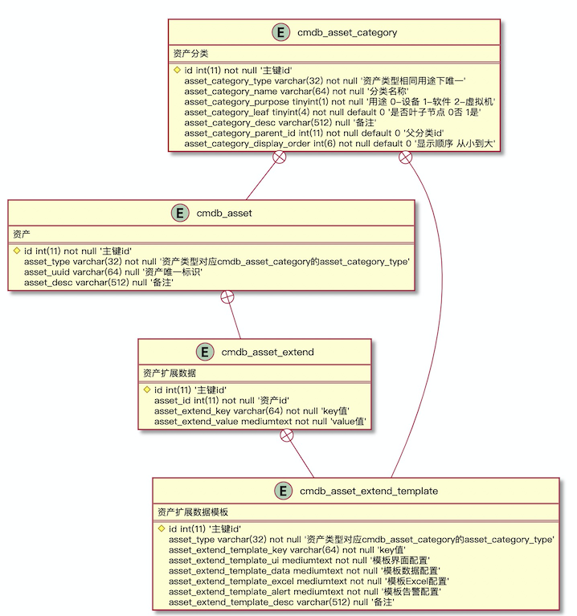

# plantuml2mysql

I liked [plantuml](http://plantuml.com/) tool for UML diagrams but use it
also for visualizing structure of relational database.
This script loads plantuml class diagram and generates
DDL for MySQL SQL dialect. You may define primary keys
with `#` prefix in field name (it means protected field
in PlantUML) and define index fields with `+` (public field
in PlantUML) prefix.

Field type noted after field name as is. Support null/not null/auto_increment 
 default value and comment that with the quotes

For example entity definition:

```plantuml
entity cmdb_asset_category {
  资产分类
  ==
  #id int(11) not null '主键id'
  asset_category_type varchar(32) not null '资产类型,相同用途下唯一'
  asset_category_name varchar(64) not null '分类名称'
  asset_category_purpose tinyint(1) not null  '用途 0-设备 1-软件 2-虚拟机'
  asset_category_leaf tinyint(4) not null default 0 '是否叶子节点 0否 1是'
  asset_category_desc varchar(512) null '备注'
  asset_category_parent_id int(11) not null default0 '父分类id'
  asset_category_display_order int(6) not null default0 '显示顺序 从小到大'
}
```

will be converted to SQL:

    drop table if exists `cmdb_asset_category`;
    CREATE TABLE `cmdb_asset_category` (
        id               INT(11) NOT NULL  COMMENT '主键id',
        asset_category_type VARCHAR(32) NOT NULL  COMMENT '资产类型,相同用途下唯一',
        asset_category_name VARCHAR(64) NOT NULL  COMMENT '分类名称',
        asset_category_purpose TINYINT(1) NOT NULL  COMMENT '用途 0-设备 1-软件 2-虚拟机',
        asset_category_leaf TINYINT(4) NOT NULL DEFAULT 0  COMMENT '是否叶子节点 0否 1是',
        asset_category_desc VARCHAR(512) NULL  COMMENT '备注',
        asset_category_parent_id INT(11) NOT NULL DEFAULT0  COMMENT '父分类id',
        asset_category_display_order INT(6) NOT NULL DEFAULT0  COMMENT '显示顺序 从小到大',
        creator                   VARCHAR(64)  NULL, 
        gmt_create                DATETIME     NULL,
        updater                   VARCHAR(64)  NULL,
        gmt_modified              DATETIME     NULL,
        PRIMARY KEY (id)) COMMENT '资产分类';

Text between class name and `==` is table description.
The description of the table is mandatory.
I was too lazy to check for absence of descriptions but
not lazy to write them in each table of my databases.

A line starting with `..` or `__`, used as a separator
into a class definition, will be ignored.

The HTML markup in comments (after `--`) is stripped.

See below the result of a more complicated sample from [database.md](database.md):



```bash
    ./plantuml2mysql.py database.md sampledb
```

```sql
CREATE DATABASE a CHARACTER SET = utf8mb4 COLLATE = utf8_unicode_ci;
USE a;

drop table if exists `cmdb_asset_category`;
CREATE TABLE `cmdb_asset_category` (
  id               INT(11) NOT NULL  COMMENT '主键id',
  asset_category_type VARCHAR(32) NOT NULL  COMMENT '资产类型,相同用途下唯一',
  asset_category_name VARCHAR(64) NOT NULL  COMMENT '分类名称',
  asset_category_purpose TINYINT(1) NOT NULL  COMMENT '用途 0-设备 1-软件 2-虚拟机',
  asset_category_leaf TINYINT(4) NOT NULL DEFAULT 0  COMMENT '是否叶子节点 0否 1是',
  asset_category_desc VARCHAR(512) NULL  COMMENT '备注',
  asset_category_parent_id INT(11) NOT NULL DEFAULT 0  COMMENT '父分类id',
  asset_category_display_order INT(6) NOT NULL DEFAULT 0  COMMENT '显示顺序 从小到大',
 creator          VARCHAR(64)  NULL,
 gmt_create       DATETIME     NULL,
 updater          VARCHAR(64)  NULL,
 gmt_modified     DATETIME     NULL,
 PRIMARY KEY (id)) COMMENT '资产分类';

drop table if exists `cmdb_asset`;
CREATE TABLE `cmdb_asset` (
  id               INT(11) NOT NULL  COMMENT '主键id',
  asset_type       VARCHAR(32) NOT NULL  COMMENT '资产类型,对应cmdb_asset_category的asset_category_type',
  asset_uuid       VARCHAR(64) NULL  COMMENT '资产唯一标识',
  asset_desc       VARCHAR(512) NULL  COMMENT '备注',
 creator          VARCHAR(64)  NULL,
 gmt_create       DATETIME     NULL,
 updater          VARCHAR(64)  NULL,
 gmt_modified     DATETIME     NULL,
 PRIMARY KEY (id)) COMMENT '资产';

drop table if exists `cmdb_asset_extend`;
CREATE TABLE `cmdb_asset_extend` (
  id               INT(11)  COMMENT '主键id',
  asset_id         INT(11) NOT NULL  COMMENT '资产id',
  asset_extend_key VARCHAR(64) NOT NULL  COMMENT 'key值',
  asset_extend_value MEDIUMTEXT NOT NULL  COMMENT 'value值',
 creator          VARCHAR(64)  NULL,
 gmt_create       DATETIME     NULL,
 updater          VARCHAR(64)  NULL,
 gmt_modified     DATETIME     NULL,
 PRIMARY KEY (id)) COMMENT '资产扩展数据';

drop table if exists `cmdb_asset_extend_template`;
CREATE TABLE `cmdb_asset_extend_template` (
  id               INT(11)  COMMENT '主键id',
  asset_type       VARCHAR(32) NOT NULL  COMMENT '资产类型,对应cmdb_asset_category的asset_category_type',
  asset_extend_template_key VARCHAR(64) NOT NULL  COMMENT 'key值',
  asset_extend_template_ui MEDIUMTEXT NOT NULL  COMMENT '模板界面配置',
  asset_extend_template_data MEDIUMTEXT NOT NULL  COMMENT '模板数据配置',
  asset_extend_template_excel MEDIUMTEXT NOT NULL  COMMENT '模板Excel配置',
  asset_extend_template_alert MEDIUMTEXT NOT NULL  COMMENT '模板告警配置',
  asset_extend_template_desc VARCHAR(512) NULL  COMMENT '备注',
 creator          VARCHAR(64)  NULL,
 gmt_create       DATETIME     NULL,
 updater          VARCHAR(64)  NULL,
 gmt_modified     DATETIME     NULL,
 PRIMARY KEY (id)) COMMENT '资产扩展数据模板';                                            
```

# Installation

The script not uses external dependencies. If you have installed Python 3
properly then just download `plantuml2mysql.py` to appropriate location and
run as any other Python script.

# Reference
grafov [https://github.com/grafov/plantuml2mysql]

Thank for contributions: 

* [An ecosystem of tools around PlantUML to render textual UML diagrams anywhere you want](https://modeling-languages.com/plantuml-textual-uml-online/)

# Similar tools

* [github.com/achiku/planter](https://github.com/achiku/planter) — generate ER diagrams from PostgreSQL tables
